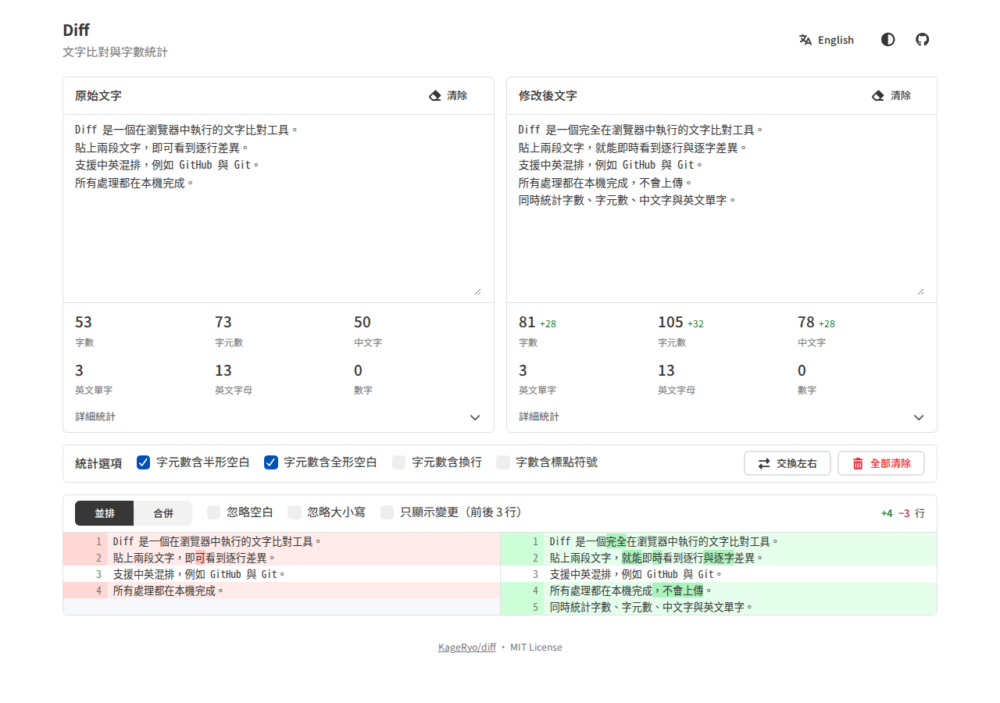

# Diff 文字比對與字數統計

[English](README.md) · [Demo](https://kageryo.github.io/diff/)

左右貼上兩段文字，即時以 git 風格標示差異，同時統計字數、字元數、中文字、英文單字、數字、符號與空白。所有處理都在瀏覽器中完成，文字不會上傳或保存。

[](https://github.com/KageRyo/diff/releases)
[](LICENSE)
[](https://tocas-ui.com/)
[](https://github.com/kpdecker/jsdiff)
[](https://developer.mozilla.org/docs/Web/JavaScript/Guide/Modules)
[](https://github.com/KageRyo/diff/actions/workflows/pages.yml)
[](CONTRIBUTING.md)
[](https://github.com/KageRyo/diff/stargazers)
[](https://github.com/KageRyo/diff/commits)

[](https://kageryo.github.io/diff/)

## 功能概覽

| 功能 | 行為 |
| --- | --- |
| 即時比對 | 逐行比對，並在修改的行內標出變動的字元，輸入時即時更新 |
| 檢視方式 | 並排或合併（git 風格），可只顯示變更與前後 3 行 |
| 比對選項 | 忽略空白（含全形與半形）、忽略大小寫 |
| 統計 | 兩側各自的字數、字元數、中文字、英文單字、英文字母、數字、符號、空白、換行、Emoji、行數與段落，並顯示兩側差值 |
| 統計選項 | 可選擇字元數是否計入半形空白、全形空白與換行，以及字數是否計入標點符號 |
| 介面 | 正體中文與 English、自動／淺色／深色主題、響應式版面 |
| 隱私 | 沒有伺服器、不上傳；瀏覽器只保存你的設定 |

## 統計規則

文字會先切成「看得到的字元」（grapheme cluster），因此 👨‍👩‍👧 這類 emoji 序列或帶重音的字母都算一個字元。每個字元只屬於一個類別：

| 類別 | 包含 |
| --- | --- |
| 中文字 | 漢字（`\p{Script=Han}`） |
| 英文字母 | 拉丁字母，含全形字母（如 `Ａ`）與帶重音的字母 |
| 數字 | 十進位數字，含全形數字（如 `０`） |
| 半形符號 | ASCII 標點與符號，如 `, . ! ? $` |
| 全形符號 | 其他標點與符號，如 `，。！「」©` |
| 半形空白 | 空白、Tab 及 U+3000 以外的空白字元 |
| 全形空白 | 全形空白（U+3000） |
| 換行 | LF、CR、CRLF（算一次）、U+0085、U+2028、U+2029 |
| Emoji | 以 emoji 呈現的字元，含 keycap 與 ZWJ 序列 |
| 其他字元 | 其餘字元，如假名、韓文、西里爾字母 |

- **字元數**：所有字元扣掉你未勾選的空白類別。預設計入半形與全形空白、不計入換行。
- **字數**：比照文書處理軟體，每個中文字或假名算 1；連續的英文字母或數字算 1。英數中間的 `'`、`-`、`_`（`don't`、`well-known`、`snake_case`）以及數字之間的 `.`、`,`（`3.14`、`1,000`）不會把它拆開。也可以勾選讓每個標點符號各算 1。
- **英文單字**：含有至少一個英文字母的英數段數量。
- **行數**為以換行分隔的行數；**段落**為含有非空白字元的行數。

## 使用方式

1. 開啟 [Demo](https://kageryo.github.io/diff/)。
2. 左側貼上原始文字、右側貼上修改後的文字。
3. 在下方查看差異，並可切換「並排」或「合併」。
4. 依需求調整統計與比對選項，設定會保存在這台裝置上。

比對會先逐行比較，再於修改的行內標出變動的字元；兩行差異太大時改為整行標色；變動極大時，行內標示超過半秒後，其餘的行也會改為整行標色。若兩段文字差異大到比對超過 2 秒，會改成整段取代顯示。

## 開發

需要 Node.js 22 以上。本專案不需要 build：頁面從 cdnjs 載入 Tocas UI，並透過 `index.html` 的 import map 從 `node_modules` 載入 jsdiff，因此請先安裝依賴再啟動。

```bash
git clone https://github.com/KageRyo/diff.git
cd diff
npm install
npm start
```

開啟 `http://localhost:8080`。

```bash
npm test                 # 統計、diff、翻譯與 import map 的單元測試
npm run browser:install  # 下載 Playwright 用的 Chromium（只需一次）
npm run test:browser     # 瀏覽器煙霧測試
npm run screenshot       # 重新產生 docs/images/screenshot.png
```

| 路徑 | 用途 |
| --- | --- |
| `js/stats.js` | 字元分類與字數計算 |
| `js/diff.js` | 逐行比對、行內標示與摺疊未變更的行 |
| `js/render.js` | 統計與 diff 的 DOM 輸出 |
| `js/i18n.js` | 語言切換與數字格式 |
| `js/locales/` | 正體中文與英文字串，每種語言一個檔案 |
| `js/lines.js`、`js/graphemes.js` | 統計與 diff 共用的切行與字元切分 |
| `js/app.js` | 事件、設定、主題與語言 |
| `scripts/` | 本機伺服器、瀏覽器測試與截圖工具 |

瀏覽器與單元測試使用 `node_modules` 中同一份 jsdiff，升級時只需執行 `npm install --save-exact diff@<版本>`。

## 部署

[Pages workflow](.github/workflows/pages.yml) 會在每次 push 與 pull request 執行單元與瀏覽器測試，並從 `main` 部署靜態檔案到 GitHub Pages。若要部署自己的 fork，請到 **Settings → Pages** 將來源設為 **GitHub Actions**，再 push 到 `main`。

Diff 是靜態網站，也可以放到任何靜態網頁伺服器：執行 `npm install` 後，發布 `index.html`、`favicon.svg`、`css/`、`js/`，以及 `node_modules/diff/libesm/` 與 `node_modules/diff/LICENSE`。

## 參與貢獻

歡迎回報問題、提出想法或送出 pull request，詳見 [CONTRIBUTING.md](CONTRIBUTING.md)。

## 致謝

- [Tocas UI](https://tocas-ui.com/)：介面元件
- [jsdiff](https://github.com/kpdecker/jsdiff)：比對演算法

## 授權

[MIT](LICENSE) © 2026 Chien-Hsun Chang.
